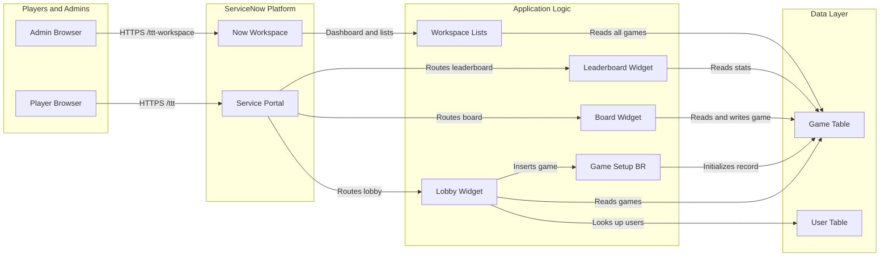

# Tic Tac Toe — ServiceNow Application

## Project Overview
A multiplayer Tic Tac Toe game built as a scoped ServiceNow application using the **now-sdk (Fluent DSL v4.6)**. Two logged-in users can play against each other via Service Portal. The game initiator always plays as **X** and takes the first turn. A Now Workspace provides a management/admin view with a dashboard and list navigation.

## Instance & Scope
| Field | Value |
|---|---|
| Scope name | `x_1561651_tic_tac` |
| Scope ID | `b2d4e6c012b0457aa296989b91424ee7` |
| App name | Tic Tac Toe |
| Service Portal URL | `/<instance>/ttt` |
| Workspace URL | `/<instance>/now/ttt-workspace/home` |
| GitHub repo | `https://github.com/siddhardhan/now-sdk-claude-tictactoe.git` |

## Architecture

### Tech Stack
- **SDK**: `@servicenow/sdk 4.6.0`, `@servicenow/glide 27.0.5`
- **Player UI**: Service Portal (AngularJS + Bootstrap 3)
- **Admin UI**: Now Workspace (NX framework, UI Builder)
- **Server logic**: GlideRecord inside SP widget server scripts (no GlideAjax in widgets)

### System Diagram



### Data Model — `x_1561651_tic_tac_game`
| Field | Type | Notes |
|---|---|---|
| `title` | StringColumn(100) | Optional game title |
| `initiator` | ReferenceColumn(sys_user) | Player X — always goes first |
| `opponent` | ReferenceColumn(sys_user) | Pre-filled for direct challenge/rematch; set by joiner otherwise |
| `board` | StringColumn(9) | 9-char string: `X`, `O`, or `-` per cell |
| `status` | ChoiceColumn | `waiting` / `in_progress` / `completed` / `draw` |
| `current_turn` | ReferenceColumn(sys_user) | Whose turn it is |
| `winner` | ReferenceColumn(sys_user) | Null on draw |

**Board positions** (left→right, top→bottom):
```
0 | 1 | 2
---------
3 | 4 | 5
---------
6 | 7 | 8
```

**Win conditions (index triples)**:
`[0,1,2] [3,4,5] [6,7,8] [0,3,6] [1,4,7] [2,5,8] [0,4,8] [2,4,6]`

---

## File Structure
```
src/
  fluent/
    tables/
      game.now.ts                        ← Game table schema
    business-rules/
      game-setup.now.ts                  ← Before-insert: init board + status + turn
    script-includes/
      tictactoe-engine.now.ts            ← ScriptInclude (kept, not called from widgets)
    service-portal/
      portal.now.ts                      ← Portal at /ttt, lobby as home page
    sp-page/
      lobby/lobby-page.now.ts            ← Page: ttt-lobby (inline containers)
      board/board-page.now.ts            ← Page: ttt-board (inline containers)
      leaderboard/leaderboard-page.now.ts← Page: ttt-leaderboard (inline containers)
    sp-widget/
      tictactoe-lobby/                   ← Lobby widget
        widget.now.ts
        server_script.js
        client_script.js
        template.html
        styles.css
      tictactoe-board/                   ← Board widget
        widget.now.ts
        server_script.js
        client_script.js
        template.html
        styles.css
      tictactoe-leaderboard/             ← Leaderboard widget
        widget.now.ts
        server_script.js
        client_script.js
        template.html
        styles.css
    workspaces/
      ttt/
        list-menu.now.ts                 ← Role, Applicability, UxListMenuConfig
        workspace.now.ts                 ← Workspace + ACL
        dashboard.now.ts                 ← Dashboard with charts
    generated/
      keys.ts                            ← Auto-generated record sys_ids
  server/
    business-rules/
      game-setup.js
    script-includes/
      TicTacToeEngine.js                 ← makeMove + getGameState (GlideAjax, not used by widgets)
```

---

## Key Components

### Business Rule (`game-setup.js`)
Runs **before insert** on `x_1561651_tic_tac_game`. Sets:
- `board` = `---------`
- `status` = `waiting`
- `current_turn` = `initiator`

### ScriptInclude (`TicTacToeEngine.js`)
Registered as client-callable (`AbstractAjaxProcessor`). **Not called from SP widgets** — kept for potential external use. All game logic lives in the board widget's `server_script.js`.

### Lobby Widget (`x_1561651_tic_tac_lobby`)
**Server actions**: `create`, `join`
- `create`: inserts a new game; optionally accepts `opponentUsername` to pre-target a specific player (direct challenge)
- `join`: sets `opponent = me`, `status = in_progress`; validates that if `opponent` is pre-assigned, only that user can join

**Server queries** (on every page load):
| `data.*` | Description |
|---|---|
| `challenges` | Games where `status=waiting AND opponent=me` (targeted at me) |
| `availableGames` | Games where `status=waiting AND initiator!=me AND opponent IS EMPTY` |
| `myWaiting` | Games where `status=waiting AND initiator=me` |
| `myGames` | My in-progress games |
| `pastGames` | My last 20 completed/draw games with mini board + W/L/D outcome |

**Client actions**: `createGame()`, `joinGame()`, `acceptChallenge()`, `openGame()`, `goLeaderboard()`

### Board Widget (`x_1561651_tic_tac_board`)
- Reads `gameId` from URL param (`$sp.getParameter`) or `input.gameId`
- **Server actions** (handled via `c.server.get()`):
  - `makeMove`: validates turn, applies move, detects win/draw, updates record, returns fresh state
  - `rematch`: creates a new game with roles swapped (loser/non-initiator becomes new X), immediately sets `status=in_progress`
- Auto-polls every 3 seconds when `status=waiting` or opponent's turn
- Shows turn indicator, win/draw banner, Rematch button on game end

### Leaderboard Widget (`x_1561651_tic_tac_leaderboard`)
- Computes per-player stats (wins, losses, draws, total, win%) in a single GlideRecord pass
- Sorted by wins DESC, then win% DESC
- Highlights current user's row; medal icons for top 3

### Now Workspace (`ttt-workspace`)
URL: `/<instance>/now/ttt-workspace/home`

**Dashboard**:
- Row 1: Active Games · Open/Waiting · Finished (single-score tiles)
- Row 2: Games by Status (donut) · Top Winners (horizontal-bar)

**Left nav categories**:
- **My Games**: Waiting / Active / History (filtered to current user as initiator)
- **All Games**: Active / Open / Completed

**Access**: requires role `x_1561651_tic_tac.player` (contains `canvas_user`). Assign this role to users post-deploy.

---

## SP Page Layout — Important Pattern
All SP pages use **inline containers** inside `SPPage()`. Never use `Record()` for `sp_container`, `sp_row`, `sp_column`, or `sp_instance` — that leaves pages empty. The `containers → rows → columns → instances` tree must be declared inside `SPPage({..., containers: [...]})` and widgets must be exported `const` so pages can import and reference them.

---

## Widget Communication — Important Pattern
SP widgets **must not** use `GlideAjax`. All server calls from widgets use `c.server.get({ action: '...', ...params })`. The server script reads `input.action` and handles the logic inline, returning results via `data.*`.

---

## Git Workflow — REQUIRED FOR ALL CHANGES

**Never commit directly to `main`.** Every feature, fix, or docs change must follow this flow:

### 1. Create a feature branch
Branch names follow the pattern `<type>/<short-description>`:
| Type | When to use |
|---|---|
| `feat/` | New feature or capability |
| `fix/` | Bug fix |
| `docs/` | Documentation only |
| `chore/` | Config, deps, tooling |

```bash
git checkout main && git pull
git checkout -b feat/my-feature-name
```

### 2. Commit on the branch
Make one commit per logical unit of work (not per file). Follow the existing commit message style:
```
feat: short description of what was added

Optional longer explanation of why or what changed.

Co-Authored-By: Claude Sonnet 4.6 <noreply@anthropic.com>
```

### 3. Push and open a PR
```bash
git push -u origin feat/my-feature-name
gh pr create --title "feat: short description" --body "$(cat <<'EOF'
## Summary
- Bullet point of what changed

## Test plan
- [ ] npm run build passes
- [ ] Deployed and verified on instance

🤖 Generated with [Claude Code](https://claude.com/claude-code)
EOF
)"
```

### 4. Merge
PRs target `main`. After the PR is reviewed and merged, delete the branch.

---

## Development Workflow

```bash
# Install dependencies (first time)
npm install

# Validate fluent files locally
npm run build

# Authenticate to ServiceNow instance (first time)
npx @servicenow/sdk auth add

# Deploy to instance
npm run deploy

# Refresh TypeScript types from instance (after first deploy of new records)
npm run types

# Capture SP Designer layout changes back to source
npm run transform
```

## Post-Deploy Setup
All SP pages (lobby, board, leaderboard) have inline widget placement defined in their fluent files — **no SP Designer steps needed**. Just `npm run deploy`.

For the workspace: assign the role `x_1561651_tic_tac.player` to any users who should access `/<instance>/now/ttt-workspace/home`.

---

## Game Flow

### Standard play
1. User A opens `/<instance>/ttt` → sees lobby
2. User A clicks **Create & Wait** → game record created (`status=waiting`, `board=---------`, `current_turn=User A`)
3. User A is redirected to board, sees "Waiting for opponent" spinner (polls every 3s)
4. User B opens lobby → game appears in **Available Games** → clicks **Join**
5. `status → in_progress`; User B redirected to board
6. User A (X) sees "Your Turn" → clicks a cell → `makeMove` via `c.server.get()`
7. Turn flips to User B (O); User A's board auto-polls and updates
8. Play continues until win or draw
9. Both players see result banner + **Rematch** and **Back to Lobby** buttons

### Direct challenge
1. User A enters User B's username in the optional "Challenge specific user" field
2. Game created with `opponent=User B`, `status=waiting`
3. Game does **not** appear in the open Available Games pool
4. User B sees it in **Challenges for Me** → clicks **Accept**
5. Game proceeds as normal from step 5 above

### Rematch
- After any finished game, clicking **Rematch** creates a new game with roles swapped
- Loser (or opponent on a draw) becomes the new initiator (X) and goes first
- New game immediately starts (`in_progress`) since both players are known
